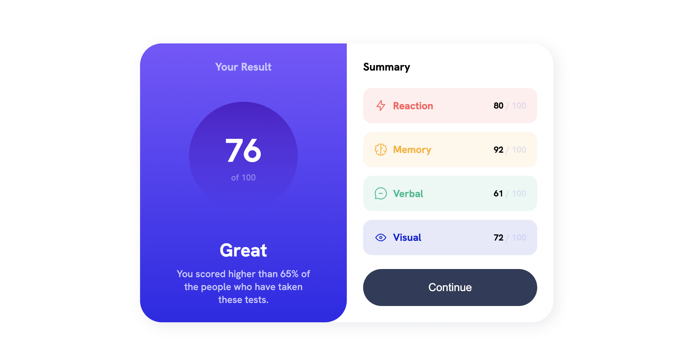

# Frontend Mentor - Results summary component solution

This is a solution to the [Results summary component challenge on Frontend Mentor](https://www.frontendmentor.io/challenges/results-summary-component-CE_K6s0maV). Frontend Mentor challenges help you improve your coding skills by building realistic projects. 

## Table of contents

- [Overview](#overview)
  - [The challenge](#the-challenge)
  - [Screenshot](#screenshot)
  - [Links](#links)
- [My process](#my-process)
  - [Built with](#built-with)
  - [What I learned](#what-i-learned)
  - [Continued development](#continued-development)
  - [Useful resources](#useful-resources)
- [Author](#author)
- [Acknowledgments](#acknowledgments)

## Overview

### The challenge

Users should be able to:

- View the optimal layout for the interface depending on their device's screen size
- See hover and focus states for all interactive elements on the page
- Use the local JSON data to dynamically populate the content

### Screenshot

### Links

- Solution URL: [https://github.com/Esosek/mentor-results-summary](https://github.com/Esosek/mentor-results-summary)
- Live Site URL: [https://esosek.github.io/mentor-results-summary/](https://esosek.github.io/mentor-results-summary/)

## My process

### Built with

- Semantic HTML5 markup
- CSS custom properties
- Flexbox
- CSS Grid
- Mobile-first workflow
- [Astro](https://astro.build/) - Web framework

### What I learned

First project built with astro! I learned how to deploy astro projects to GitHub pages.

## Author

- Frontend Mentor - [@Esosek](https://www.frontendmentor.io/profile/Esosek)
- Twitter - [@yourusername](https://www.twitter.com/yourusername)
